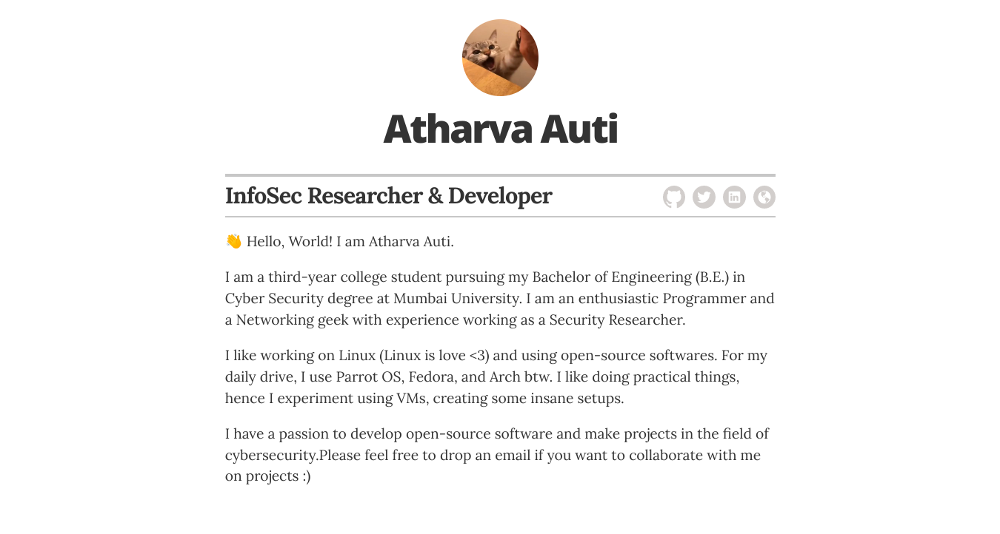

# Resume template

*Simple Resume using GitHub Pages and Jekyll Theme*
*Forked from [Jglovier's Resume Template](https://github.com/jglovier/resume-template)*

## Docs

### Running locally

To test locally make sure Ruby is installed, then run the following in your terminal:

1. Clone repo locally
2. `bundle install`
3. `bundle exec jekyll serve`
4. Open your browser to `localhost:4000`

Protip: Using `bundle exec jekyll serve --host 0.0.0.0` will make the website available for other devices on your network (so you can simply go to your PC's IP address from your mobile device - Example, Browse to http://192.168.0.69:4000)

### Running locally with Docker

To test locally with docker, run the following in your terminal after installing docker into your system:

1. `docker image build -t resume .`
2. `docker run --rm --name resume -v "$PWD":/home/app --network host resume`

### Customizing

First fork the repo to your own account. Then clone it locally and customize, or use the GitHub web editor to customize (protip: press . on your repo's webpage).

#### Options/configuration

Most of the basic customization will take place in the `/_config.yml` file. Here is a list of customizations available via `/_config.yml`:

- Title & Description
- (In Resume) Position Title, Avatar, Name, Email, Telephone, Address, Contact Info, Social Media Accounts

#### Editing content

- Most of the content configuration will take place in the `/_layouts/resume.html` file. Simply edit the markup there accordingly.

- To edit your resume content like education, associations etc, edit the `.yml` files in `/_data`.

- To edit the styling of webpage, edit the `.scss` files in `/_scss`.

- Change your avatar in `images/avatar.jpeg`.

### Publishing to GitHub Pages for free

[GitHub Pages](https://pages.github.com/) will host this for free with your GitHub account. After the setup, the site will be available at `yourusername.github.io/resume` (you can rename the repo to resume for your own use if you want it to be available at `yourusername.github.io/resume`). You can also add a CNAME if you want it to be available at a custom domain.

### Configuring with your own domain name

To setup your GH Pages site with a custom domain, [follow the instructions](https://help.github.com/articles/setting-up-a-custom-domain-with-github-pages/) on the GitHub Help site for that topic.

## Contributing

If you spot a bug, or want to improve the code, or even make the dummy content better, you can do the following:

1. [Open an issue](https://github.com/aatharvauti/resume/issues/new) describing the bug or feature idea
2. Fork the project, make changes, and submit a pull request

## License

The code and styles are licensed under the MIT license. [See project license.](LICENSE) Obviously you should not use the content of this demo repo in your own resume. :wink:
